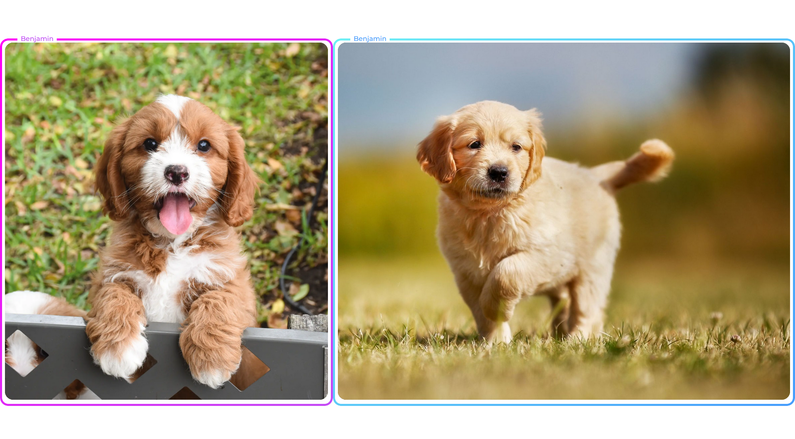

# Team HelloWorld!
The codebase for Project 041 as implemented by Team HelloWorld.

### Display-Manager
Display manager features:
* Use sockets API to upload images to it (Remind me to write up documentation for this)
* Backspace to clear images from screen
* Slashscreen for when system idle

TODO:
* Image Positioning system
* Fancier animations
* Splashscreen idle animation
* Setup Script for testing

## Team Members
All the people working on this project:
* Benjamin Jorgensen
* Tadiwa Mlambo
* Shristi Gupta
* Suryansh Singh
* Kristian Norved
* Lauchie Harvey

